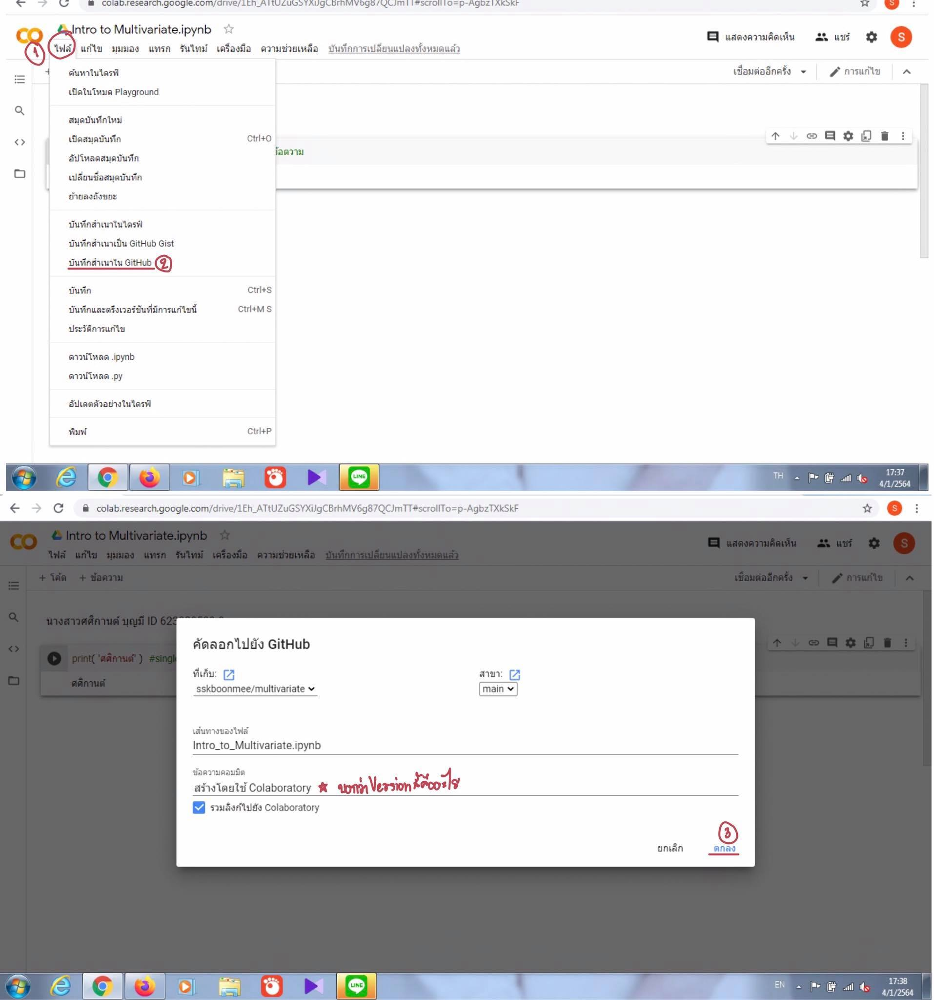

# multivariate

###  ศศิกานต์ ID 623020539-9

.md => Markdown

อธิบายการใช้งาน Github และ Google Colab ว่าหน้าที่ของแต่ละอันคืออะไรและอธิบายวิธีเซฟไฟล์จาก Google Colab ลงใน Github
Google Colab สามารถเขียน python ได้บน Browser ได้เลยมีส่วนสำคัญ 2 ส่วนคือ 1.TEXT 2.CODE สามารถจดlactureใน Google Colab ได้
Github ช่วยให้คนสามารถพัฒนา code ด้วยกันได้
วิธีเซฟไฟล์จาก Google Colab ลงใน Github คือ 1.คลิก File 2.เลือก save a copy in Github จากนั้นเลือก Project ของเรา 3.ใส่ Commit messege ซึ่งจะบอกว่า version นี้คืออะไร 4.กดOK
